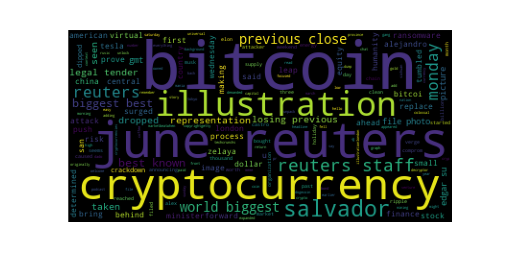
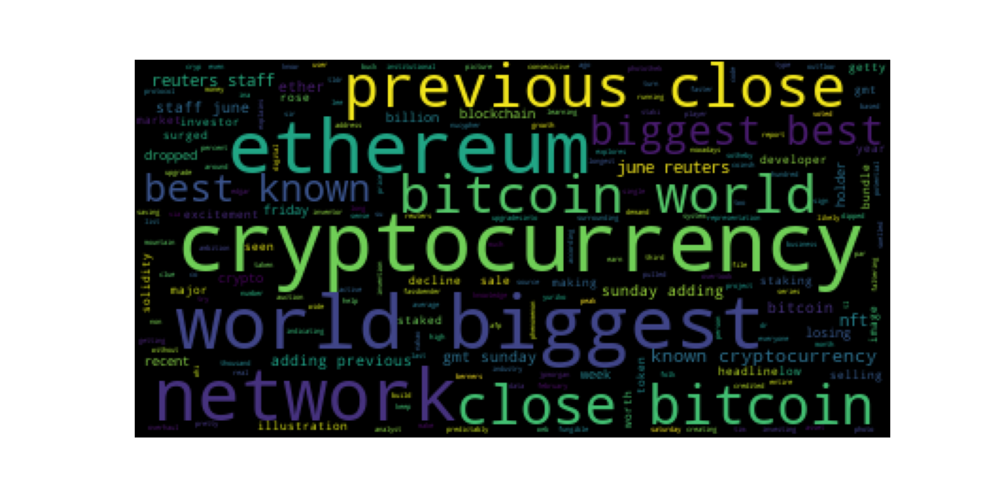

# NLP_Tales_from_the_Crypto

## Background

There's been a lot of hype in the news lately about cryptocurrency, so you want to take stock, so to speak, of the latest news headlines regarding Bitcoin and Ethereum to get a better feel for the current public sentiment around each coin.

I will be applying natural language processing to understand the sentiment in the latest news articles featuring Bitcoin and Ethereum. I will also apply fundamental NLP techniques to better understand the other factors involved with the coin prices such as common words and phrases, as well as organizations and entities mentioned in the articles.

1. [Sentiment Analysis](#1---Sentiment-Analysis)
2. [Natural Language Processing](#2---Natural-Language-Processing)
3. [Named Entity Recognition](#3---Named-Entity-Recognition)

---

## Files

[Notebook](Notebook/crypto_sentiment.ipynb)

---

## Sentiment Analysis
### Bitcoin Sentiment Scores

### Ethereum Sentiment Scores

Although Bitcoin had the highest mean positive score, Ethereum had the highest compound score as well as the highest positive score.

---

## Natural Language Processing
### Bitcoin Word Cloud

### Ethereum Word Cloud

---

## Named Entity Recognition (NER)

### Bitcoin NER

### Ethereum NER

